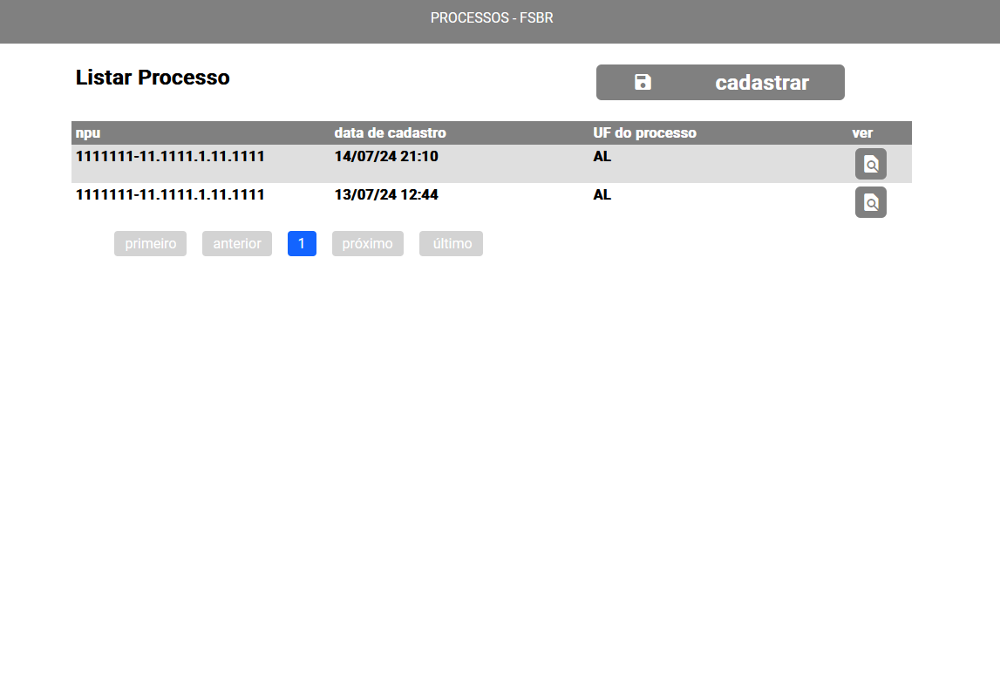
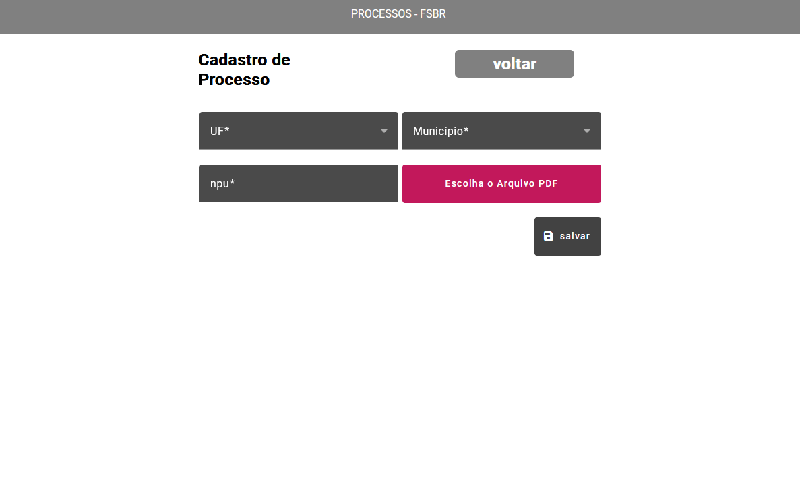
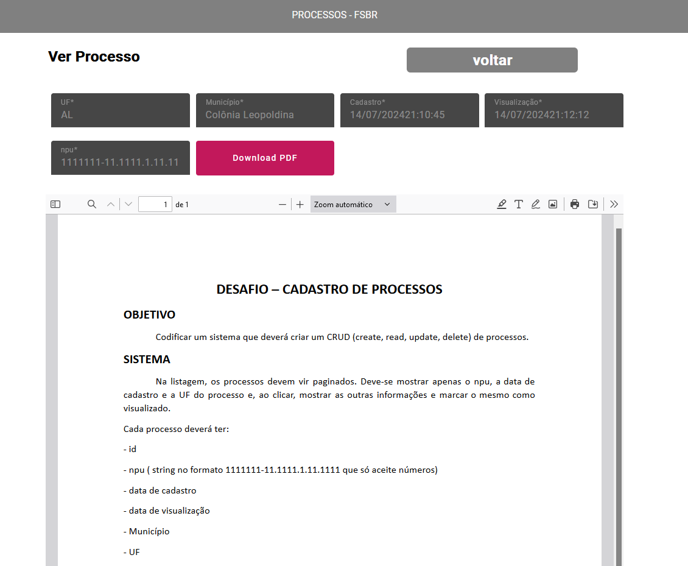

# desafio-processos-fsbr

- Aplicação com uma API SPRING e um front em ANGULAR para leitura de processos  nessa aplicaçao há leitura e envio de um arquivo em pdf

em `resources\docker\docker-compose.yml` se encontra o banco de dados pra aplicação `docker compose up` para abrir

em `cd .\front\processos-front\` se encontra front end  pra aplicação ` ng serve` para rodar

em `cd .\back\desagio-fsbr\` se encontra back end  pra aplicação 

# Front
- Angular 17
 
# Back 
- Java 17 
- Spring 

# prints das telas 

## tela  listagem dos registros dos processos  

## tela de cadastro   do processos 

## tela  para visualizar o processo

